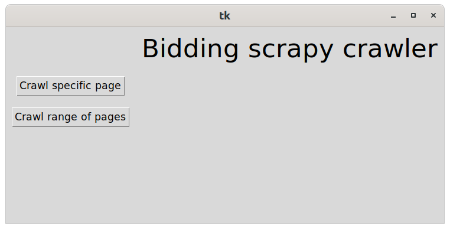
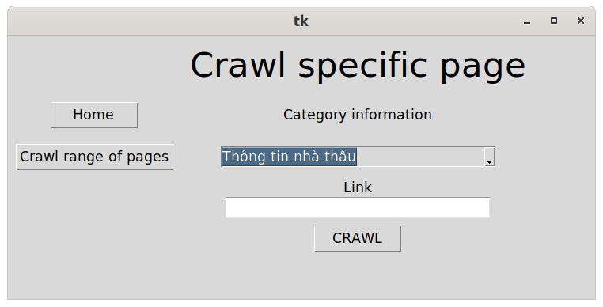
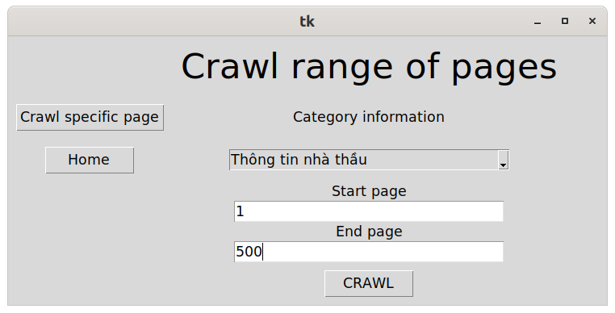

# Scrapy bots for crawling data from [muasamcong website](http://muasamcong.mpi.gov.vn/)

## To start crawling data
- Clone this project

`$ git clone https://github.com/dinhhh/DauThau-BK.git`

- Init virtual python environment

`$ cd back-end`

`$ python -m venv venv`

- Activate virtual environment

`$ source venv/bin/activate`
 
- Install requirements

`$ pip install -r requirements.txt`

- Change MONGO_URI and MONGO_DATABASE in settings.py to your mongo URI and your mongo database name

## Start crawl in terminal
- Config your spiders [in config.yaml file](back-end/bid_scrape/bid_scrape/spiders/config.yaml)
  - Range of pages you want to crawl data
  - Collection name
  - Base url
  - First key and second key for updating documents purpose only

- Run [main.py](back-end/bid_scrape/main.py) file to run all bots and start crawling

## Start crawl in UI
- Run [tkinter_app.py](back-end/bid_scrape/tkinter_app.py) 
- We have 2 modes:
  1. Crawl single page 
    
  2. Crawl multi pages continuously
    

# Maintenance
- New scrapy bot: Add its name to OPTION variable in [tkinter_app.py](back-end/bid_scrape/tkinter_app.py) to crawl in UI 
